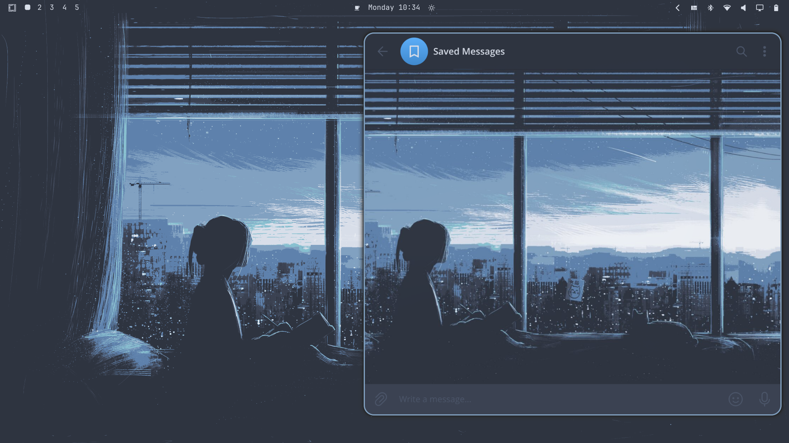

# omarchy-telegram-theme



Keeps Telegram Desktop's colors and chat background in sync with your active
Omarchy theme and wallpaper — automatically, on every theme switch and every
wallpaper cycle.

Telegram Desktop has one hard limitation this whole project works around: it
does **not** hot-swap colors while running. A theme loaded via *Settings →
Chat background → Choose from file* is re-read only when the app launches
(confirmed in Telegram's own docs). So this plugin regenerates the
`.tdesktop-theme` file on every change, then relaunches Telegram. A quick
relaunch, not an in-place color fade — that's the ceiling of what Telegram's
architecture allows.

## What it does

- Reads your active theme's `colors.toml` and maps ~90 of Telegram's real
  theme variables to it — window chrome, chat list, message bubbles, compose
  bar, menus, buttons, tooltips.
- Understands two different Omarchy `colors.toml` schemas seen in the wild:
  a named-hue one (`accent`, `muted`, `selection`, `dark_background` /
  `lighter_background` / `darker_background`, `red`/`green`/`yellow`/...)
  and an older ANSI one (`color0`-`color15`, `selection_background`). Prefers
  whichever named keys your theme provides and falls back to computed shades
  otherwise.
- Auto-detects light vs. dark and computes text contrast dynamically rather
  than assuming which of your two base colors is "light".
- Grabs whatever wallpaper is *currently* active, downscales it to a
  sensible size, and bundles it in as the chat background.
- Packages it all into a real `.tdesktop-theme` file and relaunches Telegram
  so it picks it up.
- Watches for theme switches **and** wallpaper-only cycling
  (`omarchy-theme-bg-next`) via `inotifywait` — event-driven, not polling.

## How it runs

`manifest.json` + `Service.qml` sit at the repo root. `Service.qml` is a
headless `service`-kind entry point that supervises `bin/omarchy-telegram-watch.sh`
as a child process — no logic is reimplemented in QML, it just launches and
monitors the same bash script, restarting it if it exits.

## Capabilities this plugin uses

Listed up front rather than left for a reviewer to find:

- **Reads** your Omarchy config (`~/.config/omarchy/...` /
  `~/.local/state/omarchy/...`) to get the active theme and wallpaper.
- **Writes** only inside its own data directory
  (`~/.local/share/omarchy-telegram/`).
- **Process control on one named application:** finds Telegram Desktop by
  exact process name (`telegram-desktop` or `Telegram`), sends it a normal
  termination signal, and relaunches it. This is the actual mechanism the
  plugin exists to provide — Telegram will not pick up the new theme any
  other way. Nothing else on the system is touched.
- No network access, no sudo, no credentials, no writes outside the two
  paths above.

## Install

```bash
omarchy plugin add https://github.com/rahmatov-abdullaxon/omarchy-telegram-theme --enable
```

**One-time step inside Telegram:** Settings → Chat Settings → Chat background
→ **Choose from file** → select
`~/.local/share/omarchy-telegram/omarchy.tdesktop-theme`, then **Apply This
Theme** → **Keep Changes**. You only do this once — Telegram remembers the
path and reloads it on every future launch. Don't delete or move this file
afterward.

If nothing happens when you try to open the file, check the gotchas below
before assuming it's broken — a couple of failure modes here are completely
silent.

Force a manual resync any time with:
```bash
omarchy-shell io.github.rahmatov-abdullaxon.telegram-theme resync
```

**Status of the QML, honestly:** the process-supervision and restart-retry
logic (`Service.qml` relaunching the watcher after it exits) has been
confirmed live against a real running Omarchy session, including recovering
correctly from a real crash-loop bug — see CHANGELOG.md. The
`omarchy-shell <id> resync` IPC path above has **not** been confirmed the
same way: its `IpcHandler` target binds to a value computed from the
async-loaded plugin manifest, and nothing here has verified that binding is
live by the time you'd call it. If it silently does nothing, check
`qs log -p "$OMARCHY_PATH/shell" --tail 100` first, and just switch themes
or cycle the wallpaper instead — that path is fully confirmed.

## Removal

```bash
omarchy plugin remove io.github.rahmatov-abdullaxon.telegram-theme --yes
```

This disables the plugin and removes the plugin folder, which stops the
watcher (Quickshell tears down the supervised process with it). It does
**not** delete `~/.local/share/omarchy-telegram/` (your generated theme
file) or change anything inside Telegram itself. If you want a fully clean
slate: delete that directory, then in Telegram switch back to a built-in
theme under Settings → Chat Settings.

## Gotchas actually hit while building this (all now handled by the script)

- **Telegram silently rejects oversized theme packages.** An 11MB
  4000×2250 PNG wallpaper caused the whole `.tdesktop-theme` import to do
  nothing — no error, no popup, just silence. A ~100KB 1920px-wide JPEG
  worked instantly. The generator auto-downscales via `magick`/`convert`
  before bundling (falls back to full size with a warning if neither is
  installed).
- **`;`-prefixed comment lines break the parser.** Telegram's
  `colors.tdesktop-theme` format does not support `;` comments — a single
  such line made Telegram reject the entire file silently.
- **`colors.toml` schema varies between themes.** Handled via fallback
  chains, see above.
- **The Linux binary name isn't consistent.** Some installs ship it as
  `telegram-desktop`, others simply as `Telegram` (capital T). The scripts
  try both names.
- **A kill-based single-instance guard is a race, not a fix.** The watcher
  went through three real design iterations before landing on a
  non-blocking `flock` with no killing at all. Full story, and why it's
  non-blocking rather than blocking, in CHANGELOG.md — read that before
  touching the lock logic again.
- **A predictable `/tmp` lock path is a symlink-attack surface on shared
  machines.** The lock now lives under `XDG_RUNTIME_DIR` (per-user, mode
  0700), falling back to a UID-namespaced directory rather than a bare
  shared path only if that's somehow unset.

## Requirements

```bash
sudo pacman -S --needed zip imagemagick inotify-tools
```

## Other known rough edges

- **Path auto-detection**: Omarchy sources disagree on whether the active
  theme lives under `~/.config/omarchy/current/theme` or
  `~/.local/state/omarchy/current/theme`. The script checks both.
- **Partial variable coverage**: Telegram has ~300 theme constants; this
  maps the ~90 that cover what you actually look at.
- **Resync IPC timing unconfirmed** — see the honesty note under Install.

## License

MIT — see [LICENSE](LICENSE).
